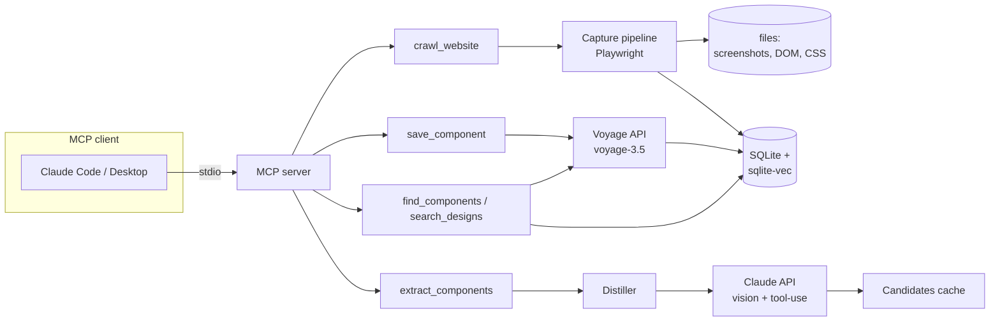

# Design Research MCP — Design (v1 MVP)

## Architecture overview

A single TypeScript stdio MCP server. Five tools sit on top of three subsystems: a Playwright **capture** pipeline, a Claude-powered **analysis** layer, and a SQLite + sqlite-vec **library** with file-based assets. Everything runs locally; the only network dependencies are the target website, the Claude API, and the Voyage API.



## Module layout

```
src/
  index.ts              entry: stdio transport, startup init
  server.ts             McpServer instance, tool registration
  config.ts             env (ANTHROPIC_API_KEY, VOYAGE_API_KEY,
                        DESIGN_RESEARCH_DATA_DIR, model overrides), paths
  db/
    database.ts         better-sqlite3 + sqlite-vec load, migrations
    schema.sql          tables below
    repo.ts             typed queries (sites, captures, candidates, components)
  capture/
    crawler.ts          Playwright orchestration (launch, goto, auto-scroll)
    styles.ts           in-page extraction: computed styles, fonts, palette, spacing
    motion.ts           CSSOM keyframes/transitions + css-tree fallback for
                        cross-origin stylesheets fetched as text
    screenshots.ts      full-page + viewport-slice shots, element crops
  analysis/
    anthropic.ts        Anthropic SDK client
    distill.ts          capture → compact JSON payload (structure outline,
                        typography summary, palette, spacing scale, motion list)
    extract.ts          one-shot vision call, forced tool-use schema → candidates
    prompts.ts          system prompt: "think like a senior product designer"
  embeddings/
    voyage.ts           embed(text[]) → float32[1024], retry w/ backoff
  tools/
    crawl-website.ts
    extract-components.ts
    save-component.ts
    find-components.ts
    search-designs.ts
  shared/
    errors.ts           typed error codes → structured MCP error results
    logger.ts           stderr-only logger
```

Key dependencies: `@modelcontextprotocol/sdk`, `playwright`, `better-sqlite3`, `sqlite-vec`, `@anthropic-ai/sdk`, `voyageai`, `zod`, `css-tree`. All have win32/Node 24 prebuilds (better-sqlite3 and sqlite-vec ship windows-x64 binaries; Chromium installed via `npx playwright install chromium`).

## Data model (SQLite)

```sql
sites       (id PK, url UNIQUE, domain, title, first_crawled_at, last_crawled_at)
captures    (id PK, site_id FK, url, page_title, viewport_w, viewport_h,
             dir_path, palette_json, fonts_json, spacing_json, motion_json,
             status, created_at)              -- new row per re-crawl (versioning)
candidates  (id PK, capture_id FK, name, category, description,
             tags_json, metadata_json, selector, bbox_json,
             crop_path, saved_component_id NULL, created_at)
components  (id PK, capture_id FK, source_url, name, category, description,
             tags_json, metadata_json, selector, bbox_json,
             crop_path, css_snippet, dom_snippet,
             created_at, updated_at,
             UNIQUE(source_url, name))        -- upsert target (US-3)
vec_components  -- sqlite-vec vec0 virtual table:
             (component_id, embedding float[1024])  -- voyage-3.5 default dims
```

`metadata_json` follows the CONTEXT.md schema: `{style[], complexity, interaction, layout, theme, motion, spacing}`. Categories are a fixed enum (navigation, hero, cards, buttons, typography, footer, form, grid, hover-effect, loader, cursor, page-transition, motion, section-separator, number-treatment, annotation, ascii, diagram, other) so filters stay reliable.

File layout under the data dir:

```
~/.design-research-mcp/
  db.sqlite
  captures/<capture-id>/   full.png, section-NN.png, dom.html, styles.json, css/*.css
  components/<component-id>/crop.png
```

## Tool contracts (input → output sketch)

- **crawl_website** `{url, viewport?}` → `{captureId, title, screenshots: n, palette, fonts, spacingScale, motionCount}`. Heavy artifacts stay on disk; result is a small summary + paths.
- **extract_components** `{url | captureId, focus?}` → `{captureId, candidates: [{candidateId, name, category, description, tags, metadata, crop_path?}]}`. Auto-crawls if the URL has no capture. `focus` optionally biases the prompt ("only navigation and typography").
- **save_component** `{candidateId} | {inline component fields}` + optional `{captureId, saveAll: true}` → saved component ids. Computes embedding at save time from `name + category + description + tags + flattened metadata`.
- **find_components** `{query, k=10, filters?: {category?, tag?, theme?, sourceUrl?}}` → ranked components with similarity scores and crop paths. Filters via SQL `WHERE` combined with vec KNN (over-fetch k*4 then filter, simple and adequate at personal-library scale).
- **search_designs** `{query, k=10}` → same index, results grouped by site with per-site best-matching components.

## Capture pipeline details

1. Launch headless Chromium (one browser per crawl call; simple and Windows-safe), realistic UA/viewport (1440×900 default).
2. `goto` with `domcontentloaded` + settle wait; auto-scroll to bottom in steps to trigger lazy-load and scroll-linked reveals, then return to top.
3. In-page evaluation collects: DOM snapshot (`outerHTML`), visible elements' computed styles (capped sample, ~1500 elements), font families + size/weight pairs (typography hierarchy), color frequency (color/background/border) → top palette, margin/padding/gap histogram → inferred spacing scale.
4. Motion: walk `document.styleSheets` CSSOM for `@keyframes` and transition rules; cross-origin sheets are fetched by URL and parsed with css-tree. Also record per-element computed `transition` shorthand where non-default.
5. Screenshots: full-page PNG + one PNG per viewport-height slice (capped at 8 slices).

## Analysis layer

One Claude call per extraction (bounded cost, US non-functional constraint): system prompt frames the task as senior-designer pattern research; user turn contains the distilled JSON + up to ~6 images (scaled-down full page + top slices). Output is forced through a tool-use JSON schema (`components: [...]`) so parsing never depends on prose. Model default `claude-sonnet-5`, overridable via `DESIGN_RESEARCH_MODEL`. If Claude returns selectors/bboxes, we render element crops with Playwright `locator.screenshot()` on the stored DOM when feasible, else fall back to the relevant slice image.

## Error handling

- Typed error codes: `INVALID_URL`, `CRAWL_TIMEOUT`, `CRAWL_BLOCKED`, `CAPTURE_NOT_FOUND`, `CANDIDATE_NOT_FOUND`, `MISSING_API_KEY(name)`, `ANALYSIS_FAILED`, `EMBEDDING_FAILED`.
- Every tool handler wraps in a catch that maps to an MCP error result (`isError: true`) with the code + human-readable message; the server process never dies on a tool failure.
- Missing API keys are checked per-call (US-5), not at startup.
- Claude/Voyage calls get 2 retries with exponential backoff on 429/5xx.

## Testing strategy

- Unit tests (vitest): spacing-scale inference, palette extraction, motion CSS parsing, repo upsert logic, distiller output size caps — all pure functions, no network.
- Integration: crawl a local fixture HTML page served from the test suite (deterministic, offline) end-to-end through capture → DB.
- MCP-level: `npx mcpjam` inspector against the built server to verify tool listing/schemas, plus an mcpjam evals config exercising crawl→extract→save→find against the fixture site (extract/save steps need real API keys; marked as "requires keys").

## Alternatives considered

- **Postgres + pgvector + S3** (per CONTEXT.md tech stack): rejected for v1 — infrastructure overhead for a single-user local tool; repo layer isolates SQL so migration later is contained.
- **Client-side analysis via MCP sampling**: rejected — sampling support is inconsistent across clients, and results would vary by client model; server-side calls give reproducible, storable output.
- **Per-element LLM calls** (screenshot every DOM region): rejected — cost explodes; one-shot page-level analysis with distilled data is the 80/20.
- **LanceDB / Chroma** for vectors: rejected — sqlite-vec keeps everything in one SQLite file next to the relational data; no extra service or storage format.
- **FTS5 hybrid search**: deferred — pure vector + SQL filters is enough at personal-library scale; FTS5 can be added in v2 without schema breakage.
- **Puppeteer**: rejected — Playwright already chosen in CONTEXT.md, better auto-wait semantics.

## Safety/approval gates

Not applicable — this project does not touch JAVIER's execution pipeline. The server performs outbound HTTP only to user-supplied URLs and the Anthropic/Voyage APIs; no shell execution, no file writes outside its data directory.
